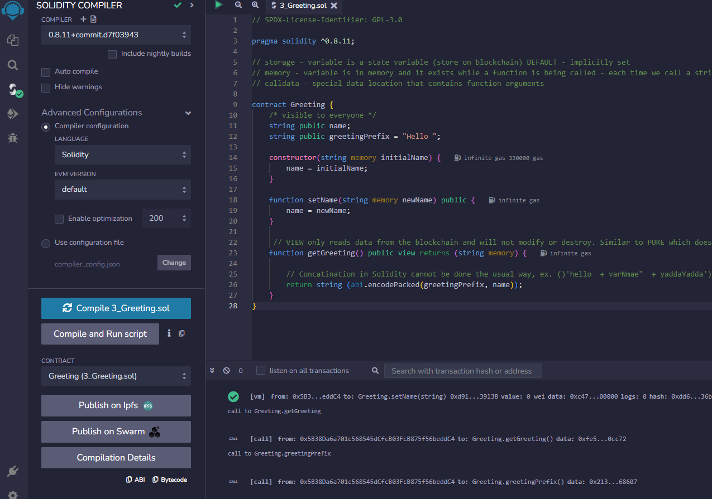
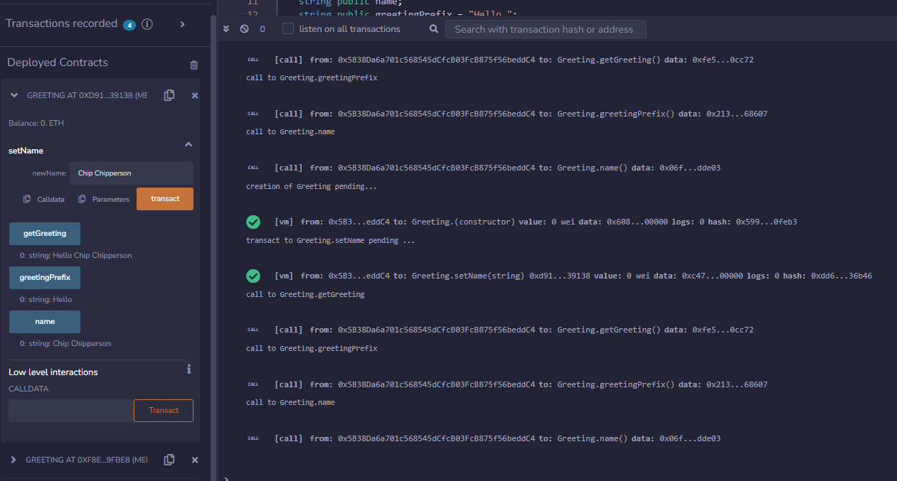

# Solidity Smart Contract

  
    
  
   
  
   
  
   
  
   
  
  
  ## Description
   Utilize the Remix web-based IDE to create, test and deploy an Etherium smart contract using Solidity.
   
 
  ## Table of Contents
  - [Description](#description)
  - [Documentation](#documentation)
  - [Deployment](#deployment)
  - [Screenshot](#screenshot)
  - [Features](#features)
  - [Acknowledgements](#acknowledgements)
  - [License](#license)
  - [Contact](#contact)

  ## Documentation
  Solidity v0.8.23
   
  <https://docs.soliditylang.org/en/v0.8.23> 
   
  Solidity by Example
   
  https://solidity-by-example.org

  ## Deployment

  This contract is deployed using the Remix VM (London) testing environment
     
  <https://remix.ethereum.org/>
 
  
  ## Screenshot
  
   
   
  
  
  
  ## Features
 
 * Remix Web-based IDE allows developers to compile, test and deploy contracts using a simple to use UI. 
 * Deployment options include live and testing environments. 
 * Built-in testing tools automatically identify each function then allows you to test the output for each one. 
 * Testing environment deploys are unlimited and are not subject to GAS fees.  
 

  # Acknowledgements
  
  * "Smart Contracts 101", Block Explorer <https://youtu.be/bNXJNeaYl8Q?si=NWJcNGDpguAPDkKe>
    
  ## License
  
   
  Permission to use this application is granted under the GPL 3.0 license. <https://www.gnu.org/licenses/quick-guide-gplv3.html>

   ## Contact:
   Holler at me! <a href="mailto:rob.atalla@robatalla816.com">rob.atalla@robatalla816.com</a>